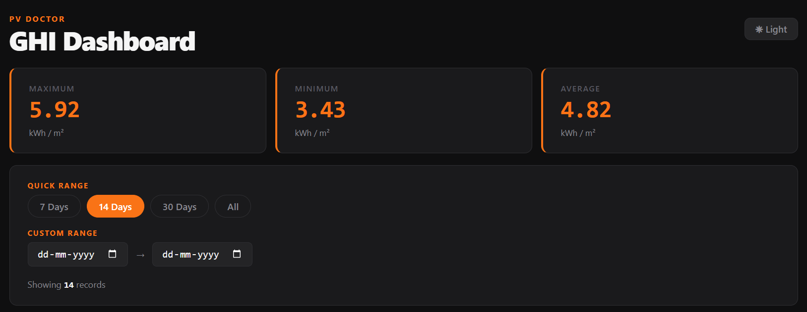
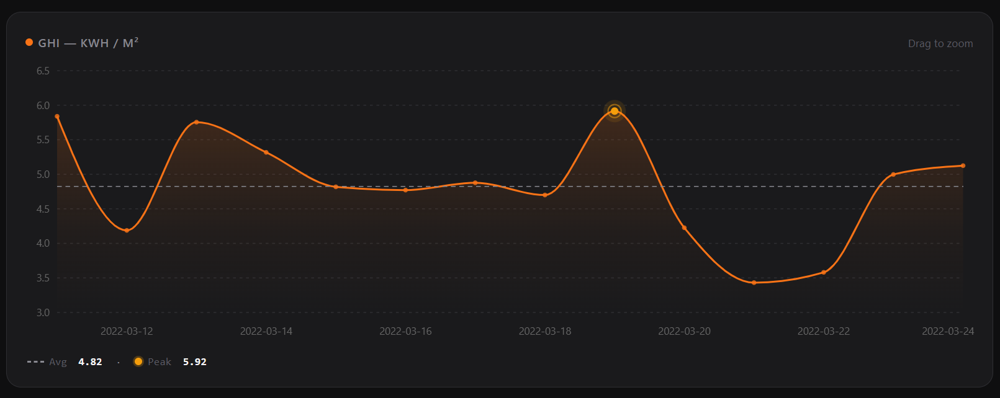

# Assignment Submission

## Visualizations

---

## Q1 A) Assumptions Made About the Data

The solution was developed based on the following assumptions:

* Each data point is continuous and there is no break in the data.
* CSV column names are always consistent i.e Date and GHI, across all files.
* No missing, null, or corrupt data records in any row.
* No duplicate records exist in the provided data.

---

## Q1 B) What Could Break the Solution?

* if columns are different, it will create extra columns instead of merging.
* Duplicate dates would create redundant data records.
* If the file is not csv or empty csv files will cause problems in concatenation.
* Large Dataset can make it crash, because we are loading everything at once(instead of chunking).

---

## Q3 A) Likely Data Sources for the Red Time Series?

* The displayed time series appears to represent financial market data. Possible data sources include Yahoo Finance, Nasdaq Data Services, Polygon.io, and IEX Cloud.
* These platforms provide both historical and real-time market data.

---

## Q3 B) How Is the Data Processed and Updated in Near Real-Time?

A typical workflow would be:

1. Market data is received from an external provider through APIs or WebSocket streams.
2. Incoming events are aggregated into fixed intervals (e.g., 10-sec or 1-min).
3. Processed records are stored in a time-series database.
4. The frontend receives updates through polling or WebSocket subscriptions.
5. The chart refreshes dynamically as new data becomes available.

---

## Q3 C) How Can Visual Noise Be Reduced Without Changing the Data?

* Display fewer points at wider zoom levels.
* Apply visual aggregation for dense regions.
* Highlight significant peaks and troughs.
* Improve tooltip behavior to focus attention on relevant values.

---

## Q3 D) Scaling the Solution to 10 Million Rows

### What Would Break?

* Increased memory usage.
* Slower network transfers.
* Expensive frontend rendering.
* Reduced application responsiveness.

### How Would You Improve It?

* Avoid sending the entire dataset to the frontend.
* Implement server-side filtering and aggregation.
* Return only the data required for the selected time range.
* Use pre-aggregated datasets for different zoom levels.
* Store data in a time-series optimized database.
* Introduce lazy loading and virtualization techniques.
